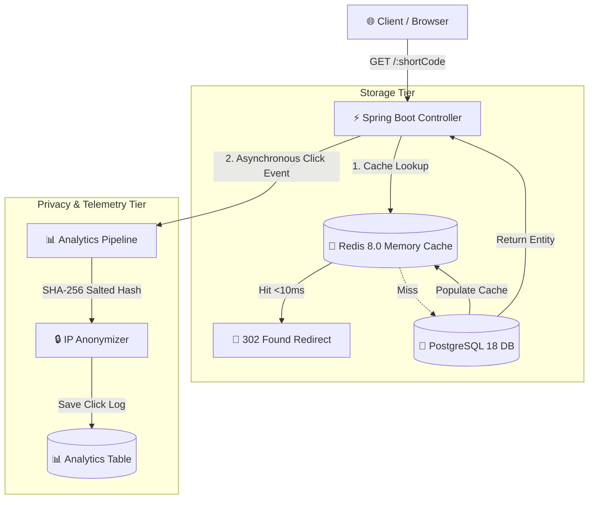

# LinkGuard - URL shortening with real-time analytics


---

## ⚡ Overview

**LinkGuard** is a enterprise-grade, high-performance URL shortener built for speed, privacy, and real-time analytics. Powered by a **Redis Cache-Aside Architecture** and **Spring Boot 3.4**, LinkGuard resolves short links in **<10ms** while logging telemetry data safely with **SHA-256 IP anonymization**.

---

## 🏗️ System Architecture & Workflow

LinkGuard utilizes a dual-tier storage strategy combining ultra-low-latency in-memory cache (**Upstash / Redis 8**) with ACID-compliant persistent storage (**Neon / PostgreSQL 18**).



### 🔁 End-to-End Workflow

1. **Short Link Resolution**:
   - Visitor requests `http://localhost:3000/drive` or `https://linkguard.app/drive`.
   - Backend queries **Redis In-Memory Cache**.
   - **Cache Hit**: Instant `302 Found` HTTP redirect in **<10ms**.
   - **Cache Miss**: Fallback to **PostgreSQL**, populate Redis cache asynchronously, and redirect visitor.

2. **Privacy-Preserving Telemetry**:
   - Visitor IP is hashed using **SHA-256** with a daily rotating salt key before persistence.
   - Raw IP addresses are **never written to disk or database tables**.

3. **Base62 Encoding**:
   - High-throughput Base62 generator converts sequential auto-increment identifiers to compact, collision-free short slugs.

---

## ✨ Features & Component Breakdown

### 🎯 Public Portal
- **Hero Command Bar**: Instant short link generation with instant one-click copying.
- **Dynamic 404 Resolution**: Theme-matched 404 page integrated directly into public routing.
- **Aesthetic Redirect Screen**: High-craft animated redirection telemetry screen with live status pings.

### 👤 User Dashboard (`/dashboard/*`)
- **Link Directory**: Interactive data table for inspecting, disabling, enabling, and deleting short links.
- **Real-Time Analytics Studio**: View click distribution by country, device type, browser, and referral source.
- **Dynamic QR Code Studio**: Instant offline client-side vector (`SVG`) and raster (`PNG`) QR code generator with live color customizer.
- **Workspace Settings**: Accessible high-contrast appearance toggle and notification preferences.

### 🛡️ Admin Portal (`/admin/*`)
- **Global Link Moderation**: Searchable directory for filtering links by target domain, short code, or keywords.
- **User Management**: Instant search filter for user emails or display names with quick refresh.
- **Security & Audit Logs**: Detailed system audit trail and threat detection metrics.

---

## 📁 Repository Structure

```
LinkGuard/
├── backend/                  # Spring Boot 3.4.2 REST API
│   ├── src/main/java/app/linkguard/
│   │   ├── config/           # Security, CORS, Redis & OpenAPI Config
│   │   ├── controller/       # REST API Endpoints & Redirect Controllers
│   │   ├── dto/              # Data Transfer Objects
│   │   ├── model/            # JPA Entities (User, Url, ClickLog, Audit)
│   │   ├── repository/       # PostgreSQL Repositories
│   │   ├── security/         # JWT Filters & RBAC Password Encoders
│   │   └── service/          # Core Business Logic & Base62 Generator
│   └── pom.xml               # Maven Project POM
├── frontend/                 # React 19 + Vite + Tailwind CSS Application
│   ├── public/               # Static Assets (og-image.png, favicon.svg)
│   ├── src/
│   │   ├── components/       # Reusable UI Components (Navbar, Footer, Modal, Button)
│   │   ├── context/          # Theme & Auth React Context Providers
│   │   ├── layouts/          # Public, User Dashboard & Admin Layouts
│   │   ├── pages/            # Public, User & Admin Page Views
│   │   └── routes/           # AppRoutes Central Router
│   ├── package.json          # Dependencies (qrcode, lucide-react, react-router-dom)
│   └── vite.config.js        # Vite Config with Dev Server Proxy (Port 3000 -> 8080)
├── docker-compose.yml        # Docker Orchestration Configuration
├── .env.example              # Environment Variable Template
├── SECURITY.md               # Security & Compliance Policy
└── README.md                 # Technical Documentation
```

---

## ⚡ Quick Start & Installation

### Prerequisites
- **Java 21 JDK**
- **Node.js 18+ & npm**
- **PostgreSQL 15+** (or Neon PostgreSQL)
- **Redis 7+** (or Upstash Redis)

### 1. Backend Setup

```bash
# Navigate to backend directory
cd backend

# Configure environment variables (or set in application-dev.yml)
cp ../.env.example .env

# Compile and run Spring Boot server
mvn spring-boot:run -Dspring-boot.run.profiles=dev
```
*Backend runs on `http://localhost:8080`.*

### 2. Frontend Setup

```bash
# Navigate to frontend directory
cd frontend

# Install Node dependencies
npm install

# Start Vite dev server
npm run dev
```
*Frontend runs on `http://localhost:3000`.*

---

## 🧪 Production Verification

Verify production build stability:

```bash
# Build production bundle
cd frontend
npm run build
```

---

## 📄 License & Security

This project is licensed under the MIT License. For security disclosures, refer to [SECURITY.md](SECURITY.md).
