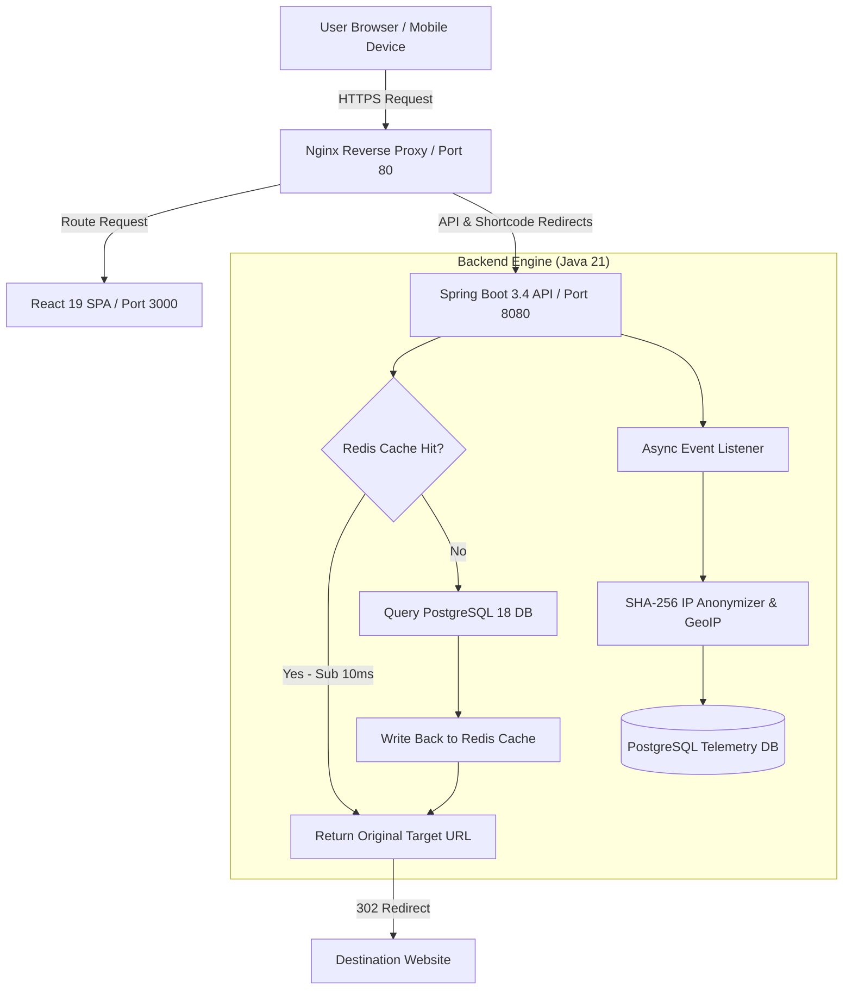
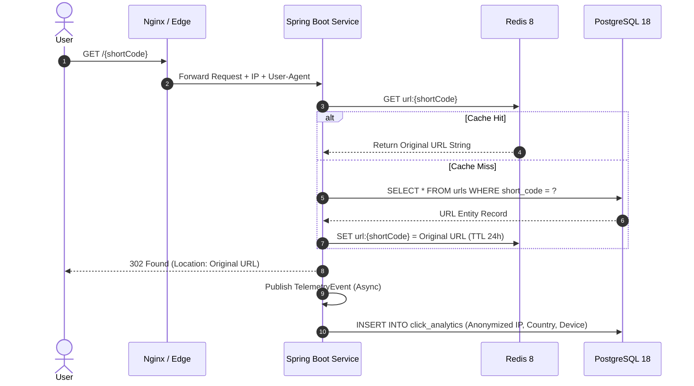

# LinkGuard 🛡️

<p align="center">
  
  
  
  
  
  
  
</p>

**Intelligent URL Shortening, Real-Time Analytics & Security Control Room**

LinkGuard is an enterprise-grade URL management platform designed for speed, privacy, and full traffic visibility. It features a sub-100ms redirection engine, custom QR code generation, real-time visitor telemetry with SHA-256 IP anonymization, and comprehensive admin security controls.

---

## ⚡ System Architecture & Workflow



### Request Lifecycle Sequence



---

## 🚀 Key Features

- **Sub-100ms Redirection Engine**: Redis cache-aside pattern ensures lightning-fast link resolution with fail-open database fallback.
- **Base62 & Custom Slugs**: Create short URLs with automatic Base62 collision resolution and custom branded slugs.
- **Dynamic QR Code Studio**: Render high-resolution PNG and SVG QR codes with custom colors and logo embedding.
- **Privacy-Compliant Analytics**: Real-time traffic breakdown by country, browser, OS, device type, and referral source with SHA-256 IP anonymization.
- **Enterprise Security Controls**: Password-protected links, rate limiting, SSRF protection, JWT token rotation, and administrative audit logging.
- **Dark & Light Mode UI**: Responsive UI built with React 19, Tailwind CSS, Plus Jakarta Sans, and Outfit display typography.

---

## 🛠️ Technology Stack

| Layer | Component | Description |
| :--- | :--- | :--- |
| **Backend Core** | Java 21 LTS | High-performance Java runtime with virtual threads support |
| **Framework** | Spring Boot 3.4.2 | REST APIs, Spring Security, Spring Data JPA, Actuator |
| **Caching Layer** | Redis 8.0 | Cache-aside redirection engine and rate limiting |
| **Database** | PostgreSQL 18 | Persistent storage with Flyway database migration scripts |
| **Frontend UI** | React 19 + Vite 6 | Fast SPA rendering with React Router 7 and TanStack Query |
| **Styling** | Tailwind CSS 3.4 | Custom semantic token system with Dark/Light mode support |
| **Containerization**| Docker Compose | Multi-container environment with Nginx proxy |

---

## 📋 Primary API Endpoints

| Method | Endpoint | Access | Description |
| :--- | :--- | :--- | :--- |
| `POST` | `/api/v1/auth/register` | Public | Register new user account |
| `POST` | `/api/v1/auth/login` | Public | Authenticate user and issue JWT tokens |
| `POST` | `/api/v1/urls` | User/Admin | Create short link or custom slug |
| `GET` | `/api/v1/urls` | User/Admin | List user's active short links |
| `GET` | `/{shortCode}` | Public | Execute 302 redirect to original target URL |
| `POST` | `/{shortCode}/verify` | Public | Verify password for protected links |
| `GET` | `/api/v1/analytics/{urlId}` | User/Admin | Get detailed traffic analytics for a link |
| `GET` | `/api/v1/admin/dashboard` | Admin | System health, global link metrics, and audit logs |

---

## ⚙️ Quick Start Guide

### Option 1: Launch with Docker Compose (Recommended)

```bash
# 1. Clone the repository
git clone https://github.com/Sahil-Ghorpade/LinkGuard.git
cd LinkGuard

# 2. Start all services via Docker Compose
docker compose up -d --build
```

Access services at:
- **Frontend UI**: [http://localhost:3000](http://localhost:3000)
- **Backend API**: [http://localhost:8080](http://localhost:8080)
- **Swagger Documentation**: [http://localhost:8080/swagger-ui.html](http://localhost:8080/swagger-ui.html)

### Option 2: Local Development Setup

#### Backend (Spring Boot 3.4)
```bash
cd backend
mvn clean install
mvn spring-boot:run
```

#### Frontend (React 19 + Vite)
```bash
cd frontend
npm install
npm run build
npm run dev
```

---

## 📄 License

Released under the **MIT License**. Built with Java 21, Spring Boot 3.4, and React 19.
