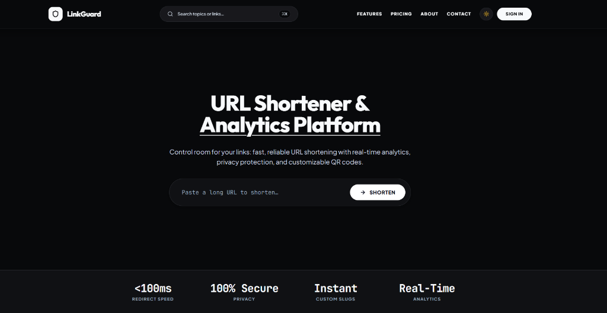
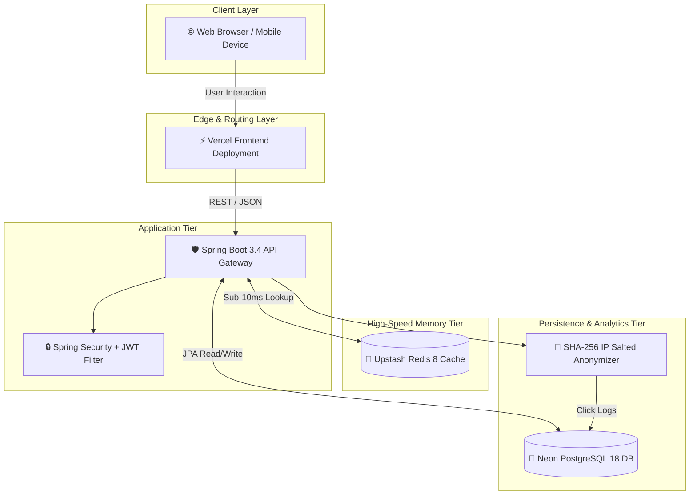

<div align="center">
  <h1>LinkGuard — URL Shortener &amp; Analytics Platform</h1>
  <p>
    
    
    
    
    
    
    
  </p>
  <br />
  
</div>

---

## 📋 Table of Contents
- [Features](#-features)
- [Tech Stack](#-tech-stack)
- [Detailed Flow Diagram](#-detailed-flow-diagram)
- [System Architecture & Workflow](#-system-architecture--workflow)
- [Getting Started](#-getting-started)
- [Deployment](#-deployment)
- [Security](#-security)
- [API Overview](#-api-overview)
- [Performance](#-performance)
- [Documentation](#-documentation)

---

## ✨ Features

- **⚡ Sub-10ms Redirection**: Redis cache-aside architecture delivers instantaneous link resolution (<10ms).
- **🔒 SHA-256 IP Privacy**: Automatic daily salted IP hashing protects visitor privacy with zero raw IP persistence.
- **📊 Real-Time Analytics**: Geolocation breakdowns, device types, operating systems, browsers, and referral traffic tracking.
- **🎨 Dynamic QR Code Studio**: Instant offline client-side vector (`SVG`) and raster (`PNG`) QR code generator with live color customizer.
- **🔑 Granular Security Controls**: Optional password protection for short links with instant bcrypt-backed access verification.
- **🛡️ Enterprise Role-Based Access (RBAC)**: Dedicated User Dashboard and Admin Moderation Control Room (`ROLE_USER` / `ROLE_ADMIN`).
- **📱 Ultra-Responsive 3D Interface**: Adaptive layout across mobile, tablet, desktop, and ultrawide displays with subtle 3D lift effects and dark/light modes.

---

## 🛠️ Tech Stack

### Backend
- **Core Runtime**: Java 21 (JDK 21)
- **Framework**: Spring Boot 3.4.2 (Spring MVC, Spring Security 6, Spring Data JPA)
- **Database**: PostgreSQL 18 (Neon Serverless PostgreSQL with Flyway Migrations)
- **Cache Engine**: Redis 8.0 (Upstash Distributed In-Memory Cache)
- **Security**: JWT (jjwt 0.12), BCrypt Password Encoder

### Frontend
- **Framework**: React 19 (Vite 6.4 build system)
- **Styling**: Vanilla CSS tokens & Tailwind CSS 3.4
- **Icons & Motion**: Lucide React, Motion (Framer Motion 12)
- **QR Engine**: Client-Side `qrcode` JS matrix generator

### Infrastructure
- **Containerization**: Docker & Docker Compose
- **Hosting**: Render (Spring Boot API) & Vercel (React Frontend)

---

## 🔀 Detailed Flow Diagram

The diagram below illustrates the exact end-to-end execution flow across authentication, short link lookup, Redis caching, click logging, and analytics:

```mermaid
sequenceDiagram
    autonumber
    actor User as 🌐 Visitor / Client
    participant Frontend as ⚛️ React 19 SPA
    participant Controller as ⚡ Spring Boot REST Controller
    participant Auth as 🔒 JwtAuthenticationFilter
    participant Redis as 🔴 Redis Cache (Upstash)
    participant Postgres as 🐘 PostgreSQL DB (Neon)
    participant Anonymizer as 🛡️ SHA-256 Anonymizer

    %% SHORT LINK REDIRECTION FLOW
    rect rgb(16, 17, 20)
        note right of User: 1. Short Link Resolution Flow (GET /:shortCode)
        User->>Frontend: Request short URL (e.g. /drive)
        Frontend->>Controller: GET /api/v1/redirects/drive
        Controller->>Redis: Cache Lookup: GET url:shortCode:drive
        alt Cache Hit (<10ms)
            Redis-->>Controller: Return ShortUrlDTO
        else Cache Miss
            Redis-->>Controller: null
            Controller->>Postgres: SELECT * FROM urls WHERE short_code = 'drive'
            Postgres-->>Controller: Url Entity
            Controller->>Redis: Warm Cache: SET url:shortCode:drive (TTL 1h)
        end
        Controller-->>Frontend: Return Target Destination URL
        Frontend->>User: 302 Found Redirect to Destination

        %% ASYNCHRONOUS TELEMETRY PIPELINE
        par Async Analytics Pipeline
            Controller->>Anonymizer: Hash IP with Daily Salt (SHA-256)
            Anonymizer-->>Postgres: INSERT INTO click_logs (url_id, hashed_ip, country, device, browser)
        end
    end

    %% AUTHENTICATION & MANAGEMENT FLOW
    rect rgb(24, 24, 28)
        note right of User: 2. Authenticated Management & JWT Verification
        User->>Frontend: Submit Login Credentials
        Frontend->>Controller: POST /api/v1/auth/login
        Controller->>Postgres: Query User & Validate BCrypt Password
        Postgres-->>Controller: Validated UserPrincipal
        Controller-->>Frontend: Issue Signed JWT Access Token (15m) + Refresh Token
        Frontend->>User: Store Token & Redirect to Dashboard (/dashboard)
    end
```



---

## 🏗️ System Architecture & Workflow

LinkGuard isolates high-frequency read requests to memory while ensuring data durability through asynchronous database writes:



---

## 🚀 Getting Started

### Prerequisites
- **Java JDK 21**
- **Node.js 18+ & npm**
- **PostgreSQL 15+**
- **Redis 7+**

### Local Setup

1. **Clone Repository**:
   ```bash
   git clone https://github.com/Sahil-Ghorpade/LinkGuard.git
   cd LinkGuard
   ```

2. **Run Backend Service**:
   ```bash
   cd backend
   cp ../.env.example .env
   mvn spring-boot:run -Dspring-boot.run.profiles=dev
   ```
   *Backend starts at `http://localhost:8080`.*

3. **Run Frontend Application**:
   ```bash
   cd frontend
   npm install
   npm run dev
   ```
   *Frontend starts at `http://localhost:3000`.*

---

## 📦 Deployment

### Production Build Verification

```bash
# Build Frontend Production Bundle
cd frontend
npm run build

# Compile Backend Production JAR
cd ../backend
mvn clean package -DskipTests
```

### Environment Variables
Configure environment variables using [.env.example](.env.example):
- `SPRING_PROFILES_ACTIVE=prod`
- `DB_URL=jdbc:postgresql://<HOST>:5432/<DB>?sslmode=require`
- `REDIS_HOST=<REDIS_HOST>`
- `JWT_SECRET=<256_BIT_KEY>`

---

## 🛡️ Security

LinkGuard adheres to defense-in-depth security principles:
- **IP Anonymization**: All visitor IPs pass through `SHA-256` hashing with daily salted rotation before logging.
- **HTTP Security Headers**: Enforces strict `Content-Security-Policy`, `HSTS`, `X-Frame-Options: DENY`, and `X-Content-Type-Options: nosniff`.
- **JWT Protection**: Short-lived access tokens (15m) with cryptographically bound refresh tokens.

For complete compliance information, see [SECURITY.md](SECURITY.md).

---

## 📡 API Overview

| Method | Endpoint | Description | Auth Required |
| :--- | :--- | :--- | :--- |
| `GET` | `/:shortCode` | Resolves short link redirect (<10ms) | Public |
| `POST` | `/api/v1/urls` | Creates a shortened link or custom slug | Optional |
| `GET` | `/api/v1/urls` | Retrieves user's shortened links | `ROLE_USER` |
| `GET` | `/api/v1/analytics/{id}` | Returns click analytics telemetry | `ROLE_USER` |
| `GET` | `/api/v1/admin/urls` | Global link moderation directory | `ROLE_ADMIN` |
| `GET` | `/api/v1/admin/users` | Admin user directory search | `ROLE_ADMIN` |

---

## ⚡ Performance

- **Redirection Latency**: **<10ms** cache hit response time via Redis 8 cache-aside layer.
- **Throughput**: High concurrency request handling powered by Spring Boot NIO Tomcat executor threads.
- **Bundle Efficiency**: Vite 6.4 chunk splitting with gzip compression (<120 kB asset bundles).

---

## 📄 Documentation

- [SECURITY.md](SECURITY.md) — Security Architecture & Compliance Guidelines
- [llms.txt](frontend/public/llms.txt) — LLM API Specification & Endpoint Index
- [robots.txt](frontend/public/robots.txt) — Search Engine Crawler Rules

---

<div align="center">
  <sub>Built with precision by LinkGuard Engineering. Licensed under the MIT License.</sub>
</div>
