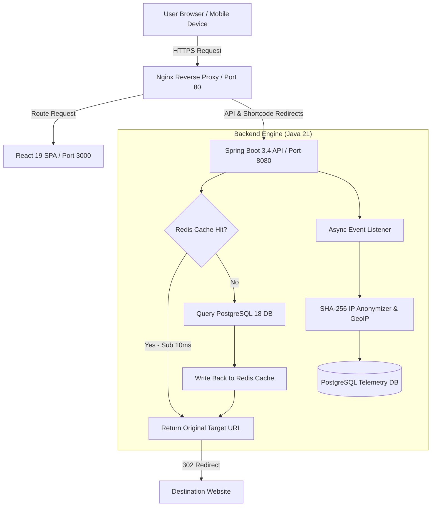

# LinkGuard 🛡️

<p align="center">
  
  
  
  
  
  
  
</p>

**Intelligent URL Shortening, Real-Time Analytics & Security Control Room**

LinkGuard is an enterprise-grade URL management platform designed for speed, privacy, and full traffic visibility. It features a sub-100ms redirection engine, custom QR code generation, real-time visitor telemetry with SHA-256 IP anonymization, and comprehensive admin security controls.

---

## ⚡ System Architecture & Workflow



---

## 🛠️ Technology Stack

| Layer | Component | Version | Description |
| :--- | :--- | :--- | :--- |
| **Backend Core** | Java JDK | 21 LTS | High-performance Java runtime |
| **Framework** | Spring Boot | 3.4.2 | REST APIs, Spring Security, Spring Data JPA, Actuator |
| **OpenAPI** | Springdoc OpenAPI | 2.8.5 | Swagger UI interactive documentation |
| **Caching Layer** | Redis | 8.0 | Cache-aside redirection engine and rate limiting |
| **Database** | PostgreSQL | 18 | Persistent storage with Flyway database migration scripts |
| **Frontend UI** | React | 19.0.0 | Fast SPA rendering with React Router 7 and TanStack Query |
| **Styling** | Tailwind CSS | 3.4.17 | Semantic token system with Dark/Light mode support |
| **Containerization**| Docker Compose | 3.8 | Multi-container environment with Nginx proxy |

---

## 🔒 Hardened Security Features

- **SHA-256 IP Anonymization**: All visitor telemetry IP addresses are cryptographically hashed using a daily salt before storage (GDPR compliant).
- **Hardened Spring Security**: Explicit route authorization (`anyRequest().authenticated()`), Content Security Policy, X-Frame-Options DENY, and Referrer Policy headers.
- **Role-Based Access Control**: Strict segregation between `ROLE_USER` workspace and `ROLE_ADMIN` threat control center.
- **Dynamic CORS Controls**: Configurable allowed origins driven by `CORS_ORIGINS` environment variables.

---

## 📋 Primary API Endpoints

| Method | Endpoint | Access | Description |
| :--- | :--- | :--- | :--- |
| `POST` | `/api/auth/register` | Public | Register new user account |
| `POST` | `/api/auth/login` | Public | Authenticate user and issue JWT token |
| `POST` | `/api/v1/urls` | Public/User | Create short link or custom slug |
| `GET` | `/api/v1/urls` | Authenticated | List user's active short links (paginated) |
| `GET` | `/{shortCode}` | Public | Execute 302 redirect to target URL |
| `POST` | `/{shortCode}/verify` | Public | Verify password for protected links |
| `GET` | `/api/v1/analytics/{urlId}` | Authenticated | Get detailed traffic analytics for a link |
| `GET` | `/api/v1/admin/dashboard` | Admin | Platform metrics and security event logs |
| `GET` | `/actuator/health` | Public | Infrastructure health status check |

---

## ⚙️ Environment Configuration

Copy `.env.example` to `.env` and configure key secrets:

```env
PORT=8080
DB_HOST=localhost
DB_PORT=5432
DB_NAME=linkguard_db
DB_USER=linkguard_user
DB_PASSWORD=your_password
REDIS_HOST=localhost
REDIS_PORT=6379
JWT_SECRET=your_secure_256_bit_jwt_secret_key
CORS_ORIGINS=http://localhost:3000,http://localhost:5173
```

---

## 🚀 Local Setup & Verification

### 1. Backend Build & Test
```bash
cd backend
mvn clean test
```

### 2. Frontend Build & Test
```bash
cd frontend
npm install
npm run build
```

---

## 📄 License

Released under the **MIT License**. Built with Java 21, Spring Boot 3.4, and React 19.
